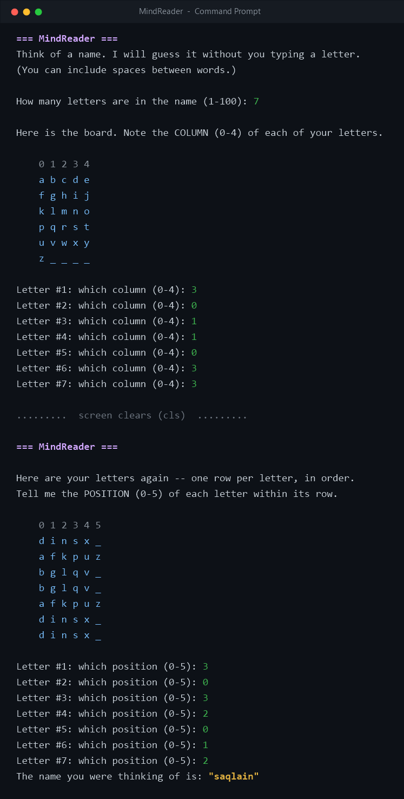

# MindReader

A small C++ console game that guesses a name you only *think* of — you never type a single letter.

I made this during my semester. It's not much, just a fun little project I wrote myself while learning C++.

## Sample run

Here it is guessing the name **saqlain**:

<p align="center">
  
</p>

## How it works

There's a fixed 6×5 board of the alphabet. Every letter sits in one cell, so it has a **column** (0–4) and a **position/row** (0–5).

1. You think of a name and tell the program how many letters it has.
2. **Round 1:** for each letter, you say which **column** it's in.
3. The screen clears, and the program shows you those columns back.
4. **Round 2:** for each letter, you say its **position** in that row.
5. Column + position points to exactly one letter — so the program rebuilds your whole name and prints it.

That's the whole trick: two numbers per letter is enough to know the letter.

## How to run

You need a C++ compiler (like g++).

```
g++ -std=c++17 -o name_guessing main.cpp
./name_guessing
```

Then just follow what it asks on screen.

## Notes

- Works with lowercase letters `a`–`z` and spaces (so multi-word names work too).
- `main.cpp` is the program.

## License

This project is licensed under the MIT License — see the [LICENSE](LICENSE) file.
